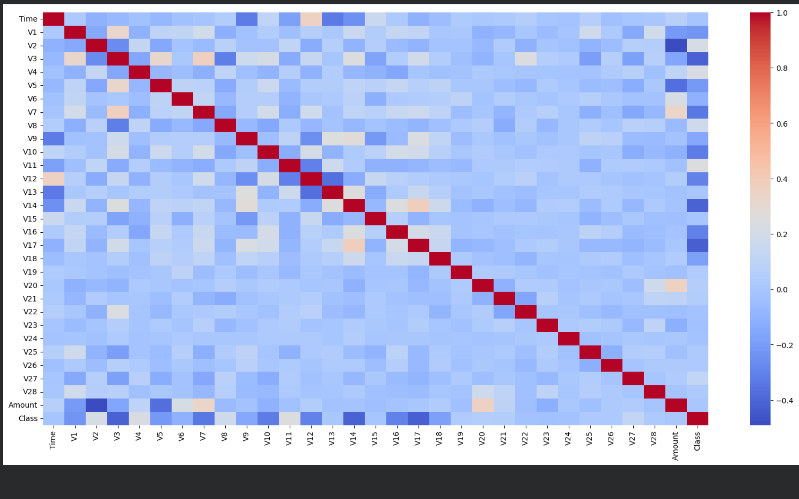
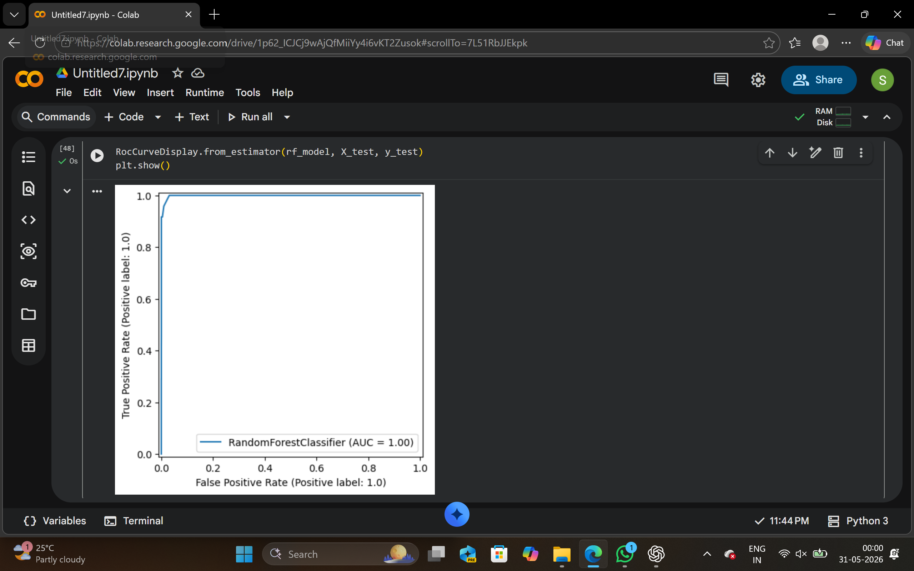

# 💳 Credit Card Fraud Detection using EDA & Machine Learning

## 📌 Project Overview

This project focuses on detecting fraudulent credit card transactions using Exploratory Data Analysis (EDA) and Machine Learning techniques.
The goal is to identify fraud patterns and build predictive models to classify fraudulent and genuine transactions.

---

## 🚀 Features

✅ Exploratory Data Analysis (EDA)
✅ Data Visualization using Matplotlib & Seaborn
✅ Correlation Analysis
✅ Handling Imbalanced Dataset using SMOTE
✅ Feature Scaling
✅ Logistic Regression Model
✅ Random Forest Classifier
✅ XGBoost Classifier
✅ Confusion Matrix & ROC Curve Evaluation

---

## 🛠️ Technologies Used

* 🐍 Python
* 📊 Pandas
* 🔢 NumPy
* 📈 Matplotlib
* 🎨 Seaborn
* 🤖 Scikit-learn
* ⚡ XGBoost

---

## 📚 ML Concepts Learned

* 📌 Classification
* 📌 Data Preprocessing
* 📌 Feature Scaling
* 📌 Imbalanced Learning
* 📌 Precision & Recall
* 📌 ROC-AUC Evaluation
* 📌 Feature Importance
* 📌 Model Comparison

---

## 📂 Dataset

📎 Credit Card Fraud Detection Dataset from Kaggle

---

## 📊 Project Workflow

1️⃣ Data Collection
2️⃣ Data Cleaning
3️⃣ Exploratory Data Analysis (EDA)
4️⃣ Data Visualization
5️⃣ Feature Scaling
6️⃣ Handling Imbalanced Data using SMOTE
7️⃣ Model Training
8️⃣ Model Evaluation
9️⃣ Performance Comparison
🔟 Final Insights & Conclusions

---

## 🎯 Models Used

* 📍 Logistic Regression
* 🌲 Random Forest
* ⚡ XGBoost

---

## 📈 Evaluation Metrics

* ✅ Accuracy
* ✅ Precision
* ✅ Recall
* ✅ F1-Score
* ✅ ROC-AUC Score
* ✅ Confusion Matrix

---

## 🧠 Key Insights

* Fraud transactions are extremely rare compared to genuine transactions.
* SMOTE significantly improved fraud detection performance.
* Random Forest and XGBoost performed better than Logistic Regression.
* Recall is an important metric in fraud detection because missing fraudulent transactions can be costly.

---

## 🌟 Future Improvements

* 🔹 Hyperparameter Tuning
* 🔹 Cross Validation
* 🔹 Real-time Fraud Detection
* 🔹 Deployment using Streamlit/Flask

---

## 📊 Project Visualizations

### 🔥 Correlation Heatmap

### 📈 ROC Curve

### 📉 Confusion Matrix

---

## 🙌 Conclusion

This project helped in understanding real-world Machine Learning workflows including EDA, preprocessing, imbalanced learning, model building, and evaluation techniques used in fraud detection systems.

